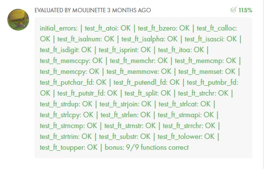

## ❔ Basic Overview

`libft` is a part of Codam (42 network) curriculum for 2020 cohort. The aim of this project is to re-code a set of the `libc` functions as well as a set of functions that are either not included in the libc, or included in a different form.

## ❕ Must Have Functions

| Name | Description |
| --- | --- |
| `memset` | The memset(void *s, int c, size_t n) function fills the first n bytes of the memory area pointed to by s with the constant byte c. |
| `bzero` | The bzero(void *s, size_t n) function erases the data in the n bytes of the memory starting at the location pointed to by s, by writing zeroes (bytes containing '\0') to that area. |
| `memcpy` | The memcpy(void *dest, const void *src, size_t n) function copies n bytes from memory area src to memory area dest. The memory areas must not overlap. |
| `memccpy` | The memccpy(void *dest, const void *src, int c, size_t n) function copies no more than n bytes from memory area src to memory area dest, stopping when the character c is found. |
| `memmove` | The  memmove(void *dest, const void *src, size_t n) function copies n bytes from memory area src to memory area dest.  The memory areas may overlap: copying takes place as though the bytes in src are first copied into a temporary array that does not overlap src or dest, and the bytes are then copied from the temporary array to dest. |
| `memchr` | The memchr(const void *s, int c, size_t n) function scans the initial n bytes of the memory area pointed to by s for the first instance of c. Both c and the bytes of the memory area pointed to by s are interpreted as unsigned char. |
| `memcmp` | The memcmp(const void *s1, const void *s2, size_t n) function compares the first n bytes (each interpreted as unsigned char) of the memory areas s1 and s2. |
| `strlen` | The strlen(const char *s) function calculates the length of the string pointed to by s, excluding the terminating null byte ('\0'). |
| `strlcpy` | The strlcpy(char *dst, const char *src, size_t size) function copies up to size - 1 characters from the NUL-terminated string src to dst, NUL-terminating the result. |
| `strlcat` | The strlcat(char *dst, const char *src, size_t size) function appends the NUL-terminated string src to the end of dst.  It will append at most size - strlen(dst) - 1 bytes, NUL-terminating the result. |
| `strchr` | The strchr(const char *s, int c) function returns a pointer to the first occurrence of the character c in the string s. |
| `strrchr` | The strrchr(const char *s, int c) function returns a pointer to the last occurrence of the character c in the string s. |
| `strnstr` | The strnstr(const char *big, const char *little, size_t len) function locates the first occurrence of the null-terminated string little in the string big, where not more than len characters are searched.  Characters that appear after a ‘\0’ character are not searched. |
| `strncmp` | The strncmp(const char *s1, const char *s2, size_t n) function is similar, except it compares only the first (at most) n bytes of s1 and s2. |
| `atoi` | The atoi(const char *nptr) function converts the initial portion of the string pointed to by nptr to int. |
| `isalpha` | Checks for an alphabetic character. |
| `isdigit` | Checks for a digit (0 through 9). |
| `isalnum` | Checks for an alphanumeric character. |
| `isascii` | Checks whether c is a 7-bit unsigned char value that fits into the ASCII character set. |
| `isprint` | Checks for any printable character including space. |
| `toupper` | If c is a lowercase letter, toupper() returns its uppercase equivalent, if an uppercase representation exists in the current locale.  Otherwise, it returns c. |
| `tolower` | If c is an uppercase letter, tolower() returns its lowercase equivalent, if a lowercase representation exists in the current locale.  Otherwise, it returns c. |
| `calloc` | The  calloc(size_t nmemb, size_t size)  function allocates memory for an array of nmemb elements of size bytes each and returns a pointer to the allocated memory. The memory is set to zero. If nmemb or size is 0, then calloc() returns either NULL, or a unique pointer value that can later be successfully passed to free(). |
| `strdup` | The strdup(const char *s) function returns a pointer to a new string which is a duplicate of the string s.  Memory for the new string is obtained with malloc(), and can be freed with free(). |

## 💩 Moulinette Results

